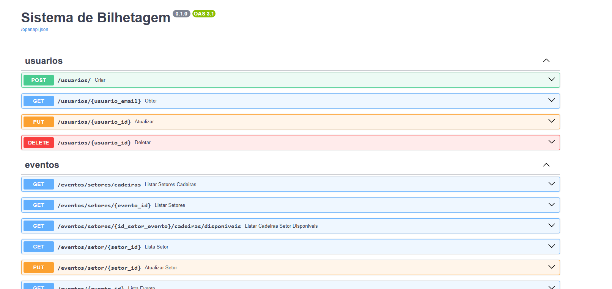
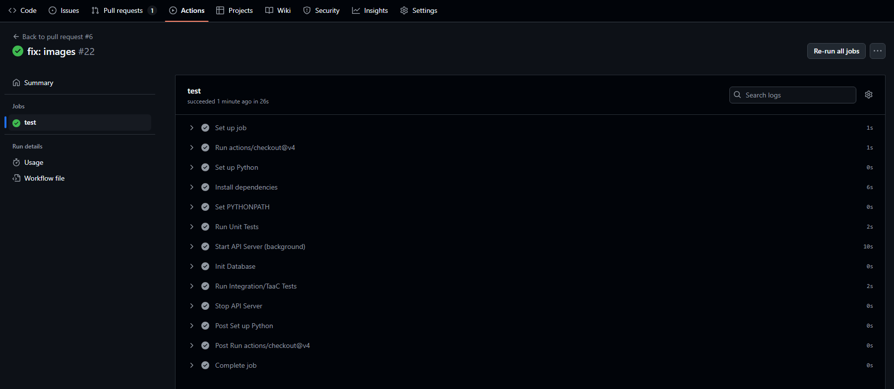

# O desafio 🎯

Este projeto é a entrega do **case técnico para vaga de Engenheiro de Software Sênior no Itaú Unibanco**, onde foi solicitado o desenvolvimento do seguinte desafio:

Você deverá propor uma arquitetura na AWS e desenvolver uma solução funcional (em sua stack de preferência) para um sistema de bilhetagem com as seguintes características:

O sistema deve permitir solicitação, reserva e compra de ingressos.
Durante o processo de compra, o sistema deve oferecer produtos adicionais como pipoca, chocolate, refrigerante, etc.
A solução deve conter uma única base de código (um único projeto/solution), mesmo que a arquitetura proposta seja orientada a microserviços. Isso facilitará a apresentação e a avaliação do seu trabalho.
 
🛠️ O que esperamos:

Um desenho de arquitetura AWS (pode ser feito com ferramentas como Lucidchart, Draw.io, ou similar).
Código-fonte funcional com instruções claras de como rodar o projeto. (Pode ser compartilhado um repositório GitHub pessoal, ou o envio do código por e-mail).
Documentação breve explicando suas decisões técnicas.

---


# Arquitetura AWS:


## ☁️ Serviços AWS Utilizados

| Serviço           | Finalidade                                                  |
|-------------------|-------------------------------------------------------------|
| S3 + CloudFront   | Hospedagem do Microfrontend com caching e performance       |
| API Gateway (BFF) | Interface única de acesso aos microsserviços                |
| ECS (Fargate)     | Execução dos serviços backend (pedidos, eventos etc.)       |
| RDS PostgreSQL    | Banco relacional com transações ACID                        |
| RDS Proxy         | Multiplexação segura das conexões ao banco                  |
| EventBridge       | Expiração automática de reservas                            |
| Lambda            | Geração de NFe e expiração de pedidos                       |
| Cognito           | Autenticação e autorização de usuários                      |
| WAF + Shield      | Proteção contra ataques como DDoS e SQL Injection           |
| CloudWatch + X-Ray| Observabilidade e tracing distribuído                       |
| QuickSight        | Dashboards analíticos via RDS replica ou arquivos do S3     |

---

## 🏦 Alinhamento com o Modelo Arquitetural do Itaú

A solução foi estruturada com base no modelo de arquitetura do Itaú Unibanco, dividido em três camadas: **Core**, **Experiência** e **Canais Digitais**. Essa abordagem promove clareza de responsabilidades, consistência entre camadas e confiabilidade para escalar com segurança.

---

### 🔶 Camada Core — *“Coração do negócio”*  
> Onde vivem as regras críticas, transações e a persistência confiável dos dados.

- Aplica regras de negócio como confirmação de pedidos e geração de nota fiscal.  
- Garante consistência e integridade dos dados com transações ACID no PostgreSQL.  
- Desacoplada dos canais, foca na robustez da lógica central.  
- Altamente disponível com RDS Multi-AZ, Proxy e Read Replica.

**🔧 Pilar da Engenharia**  
- Arquitetura modular e escalável com uso das melhores práticas AWS.  
- Robustez transacional com PostgreSQL e controle de concorrência.  
- Observabilidade implementada com logs, métricas e tracing distribuído (X-Ray).

---

### 🟧 Camada de Experiência — *“Onde a jornada do cliente acontece”*  
> Traduz regras de negócio em experiências fluídas, claras e eficientes.

- Implementada com ECS + API Gateway (BFF), conectando serviços com simplicidade.  
- Abstrai a complexidade do core com APIs REST bem definidas e documentadas.  
- Garante fluidez na jornada de reserva, confirmação de ingressos e compra de produtos.

**🚀 Pilar da Transformação**  
- Arquitetura pronta para evolução, com camada desacoplada de geração de NFe.  
- Simulação local por CLI para desenvolvimento ágil e testes rápidos.  
- Preparada para integração com camadas analíticas e de insights via SOR.

---

### 🟨 Camada de Canais Digitais — *“Contato direto com o cliente”*  
> Responsável por entregar a experiência final nos canais web e mobile.

- Microfrontend hospedado em S3 + CloudFront, com autenticação via Cognito.  
- Proteção com WAF e AWS Shield contra ataques e acesso indevido.  
- Coleta de comportamento e preparada para análises via QuickSight.

**👥 Pilar de Pessoas**  
- Organização clara para facilitar o onboarding e a colaboração entre times.  
- Testes de integração e documentação completa garantem segurança no ciclo de entrega.  
- Frontend desacoplado permite múltiplos canais com experiência unificada.

---

### 🧱 Backend (ECS Fargate)
- `eventos-api-service`: gerenciamento de eventos e setores
- `produtos-api-service`: gerenciamento de produtos adicionais
- `usuarios-api-service`: login e autenticação de usuários
- `pedidos-api-service`: solicitações, reservas e finalizações
- `pagamento-api-service`: controle do fluxo de pagamentos

Funcionalidades como geração de nota fiscal e expiração são tratadas por Lambdas desacopladas.

#### Por que da decisão?
- Múltiplas APIs REST estruturadas por domínio (ex: /eventos, /pedidos, /pagamentos)
- Controle de infraestrutura sem gerenciar servidores
- Escalabilidade horizontal, mas com lógica de negócio interdependente
- Conexão com RDS PostgreSQL (transacional) via RDS Proxy
- Custo previsível
- Observabilidade, segurança e fácil manutenção

---

### 🗃️ Banco de Dados
- **PostgreSQL via Amazon RDS**
- Modelagem relacional com as entidades já definidas e modeladas!
- RDS Proxy para controle de conexões simultâneas
- Read Replica para relatórios analíticos e separação de carga

#### Por que da decisão?
- PostgreSQL tem controle de transações mais robusto que o MySQL, com melhores garantias ACID e suporte a isolamento de transações com granularidade maior.
- Controle de concorrência essencial para reservas e pagamentos
- RDS Proxy evita explosão de conexões com ECS
- Failover simples via Multi-AZ
- Rastreabilidade e auditoria fiscal com os relacionamentos entre entidades
- Melhor equilíbrio entre custo, robustez e escalabilidade (Comparado ao Aurora Serveless por exemplo)

---

### 🧾 Fluxos Adicionais Descoplados
#### **Nota fiscal:** Lambda + SNS → JSON salvo em bucket S3 + envio via email/SMS
- Fluxo desacoplado para geração de nota fiscal pós pagamento
- Menor custo
- Permite qualquer consumidor escutar o SNS de notificação caso precise (por ex. siglas contabeis)
- Garante auditoria e contingencia específica sem mexer no motor de negócio central (ECS)

#### **Expiração:** EventBridge programado + Lambda → atualiza status em caso de inatividade
- Fluxo desacoplado para expirar as reservas que não cumpriram o prazo estimado
- Economia de recursos
- Role restrita para ler e atualizar só a tabela de pedidos
- Escalabilidade controlada

---

### API Gateway (BFF)
#### Por que da decisão?
- Ponto único de entrada para o front end (mobile e web..)
- Segurança
- Abstração das camadas
- Orquestração e escalabilidade separada
- Padronização de interfaçe

---

### 🧩 Frontend (Microfrontend)
- Hospedado em **S3 + CloudFront** com criptografia em repouso
- Autenticação via **Cognito** com JWT
- Distribuído via **Cloudfront**
- Proteção com **WAF** e acesso via HTTPS com **ACM**
- **AWS Shield** contra DDoS

#### Por que da decisão?
- Autenticação segura
- MFE Simples e escalável
- Global com proteção contra DDoS e SQL Injection
- Compatível com Web e Mobile

---

### 🔍 Observabilidade
- **ClouWatch Logs** Armazena logs dos containers ECS e Lambdas
- **ClouWatch Metrics** Métricas como uso de CPU, requisições, tempo de resposta, falhas e de comportamento dos clientes (ex. quantidade de pedidos)
- **ClouWatch Alarms** Detecção de anomalias (ex: 5xx em excesso, tempo de resposta alto)
- **ClouWatch X-ray**  Tracing completo entre APIs ECS, Lambdas e chamadas externas
- Preparado para integração com **QuickSight** (SOR)

#### Por que da decisão?
- Garantir visibilidade completa sobre cada ponto da jornada de experiencia do cliente
- Garantir visibilidade da performance do sistema
- Medir e entender o comportamento do cliente

---

### 📊 Relação entre Número de Usuários e Custo (Arquitetura AWS)

| Nº de Usuários | Custo Mensal (USD) | Custo Anual (USD) |
|----------------|--------------------|-------------------|
| 100            | $594.87            | $7,138.44         |
| 1.000          | $694.48            | $8,333.76         |
| 10.000         | $1,255.49          | $15,065.88        |

---

## 🎟️ BilheteriaShow – Sistema de Bilhetagem de Show's

Sistema de bilhetagem completo para eventos, desenvolvido em Python com uma arquitetura limpa e escalável, utilizando FastAPI no backend, SQLite como banco de dados local e uma interface baseada em terminal (CLI).

---

## 🧱 Funcionalidades
- Cadastro e listagem de eventos, produtos e setores
- Criptografia de senha
- Sistema de reservas com bloqueio temporário (15 minutos)
- Assentos numerados (cadeiras) e setores de pista
- Adição de produtos opcionais ao pedido
- Pagamento com simulação de diferentes métodos (PIX, cartão, boleto)
- Gateway de integração com documentação no swagger (OpenAPI)
- Geração de nota fiscal simulada via json
- Expiração automática de reservas pendentes
- Estrutura modular por domínio (eventos, usuários, pedidos, produtos, pagamento)
- Testes unitários e de integração com pytest
- CI com GitHub Actions
- Banco de dados SQLite (sem ORM, queries puras)
- Interface totalmente baseada em terminal
- Geração de logs
- Coleta de métricas de uso (acessos a setores, pedidos por status)

---

## 🧱 Arquitetura e Estrutura

A aplicação foi modelada com uma arquitetura MVC, simulando uma API de microserviços e uma interface via terminal, atuando como frontend simulador.

```
BilheteriaShow/
│
├── app/                  # Lógica do sistema
│   ├── controllers/      # Regras de negócio (pedidos, eventos, produtos, etc)
│   ├── interface/        # Interface de usuário via terminal
│   ├── jobs/             # Ações automáticas em segundo plano, como expiração de pedidos
│   ├── models/           # Modelos de dados dos domínios
│   ├── repositories /    # Camada de abstração para comunicação com o bando de dados       
│   ├── tests /           # Testes unitários
│
├── database/             # Conexão SQLite + criação da modelagem de dados
├── logs/                 # Output dos logs e métricas do sistema
├── notas_fiscais/        # Output da geração de NF
├── tests/                # Testes de integração (TaaC)
├── bilhetagem.db         # Banco SQLite local (gerado automaticamente)
├── logger.py             # Log das operações
├── main.py               # Interface principal de navegação (CLI)
├── run.py                # Geração do servidor do FastApi integrado com Swagger
├── metrics.py            # Coleta de métricas de uso
├── requirements.txt      # Dependências Python
└── 
```

---

## 🚀 Como Executar

### 1. Clone o projeto
```bash
git clone <<<REPO>>>
cd BilheteriaShow
```

### 2. Crie um ambiente virtual (recomendado)
```bash
python -m venv venv
source venv/bin/activate  # Linux/macOS
venv\Scripts\activate   # Windows
```

### 3. Instale as dependências
```bash
pip install -r requirements.txt
```

### 4. Execute o servidor de hospedagem FastAPI
```bash
uvicorn run:app --reload
```

### 5. Execute a interface do sistema
```bash
python main.py
```

---

## 🚀 Documentação da API (FastAPI) no OpenAPI



### 1. Depois de executar o servidor do FastAPI
```bash
uvicorn run:app --reload
```

### 2. Entre em:
```
http://localhost:8000/docs
```

---

## 🚀 Valide a esteiras automatizadas de testes (CI) pós commits


---
## 🧠 Funcionalidades

- Autenticação de usuários (simples via ID e nome)
- Listagem de eventos e setores
- Reserva temporária de ingressos (15 minutos)
- Adição de produtos adicionais à compra (ex: pipoca, refrigerante)
- Geração de pedidos com persistência
- Expiração automática de reservas não finalizadas
- Visualização de pedidos
- Emissão de notas fiscais (simulada)
- Coleta de métricas de uso (acessos a setores, pedidos por status)

---

## 🛠️ Diferenciais Técnicos

- Replicação da arquietura AWS em código (CLI sendo o canal, FastApi sendo o BFF com a camada de experiência + core)
- **Concorrência controlada** na reserva de ingressos com transações
- **Thread background** para limpeza de pedidos expirados
- Modularização clara entre controle, interface e banco
- Arquitetura facilmente portável para um backend FastAPI real
- Cobertura de testes de integração para simular jornada completa
- Criptografia de dados
- Esteira de CI no GitHub para rodar testes automatizados e garantir a integridade do código

---

## 📌 Considerações

- Todo o código simula um comportamento real de microserviços e API Gateway por meio de organização de módulos, que foi orçado na arquitetura AWS incial.

---


## ✍️ Autor

**Erik Mendes**  
Engenheiro de Software  
🔗 linkedin.com/in/erikfernandoms

